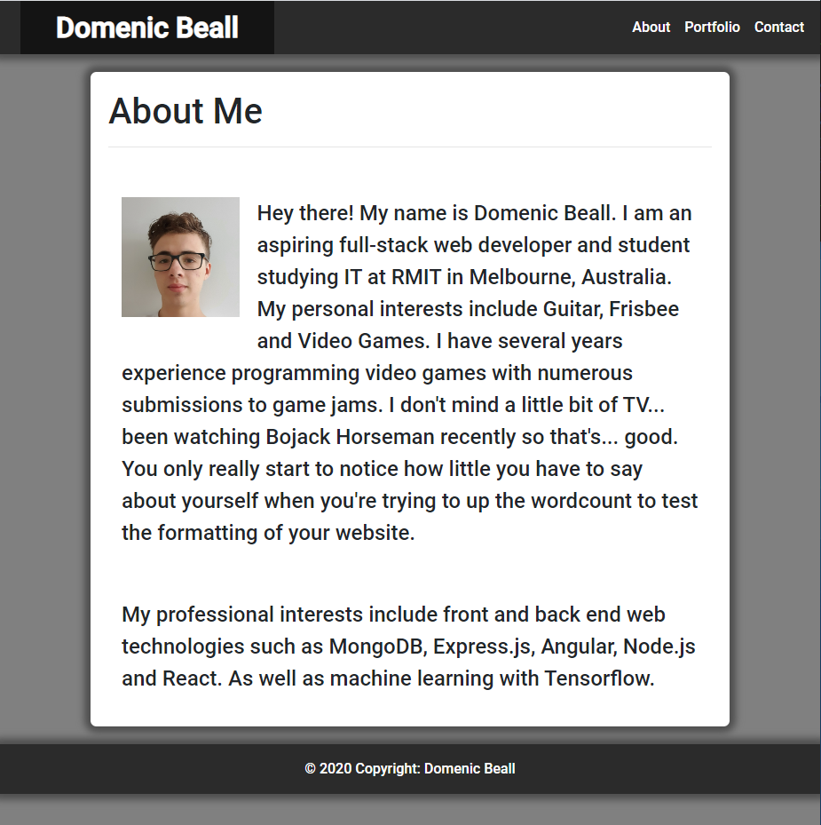
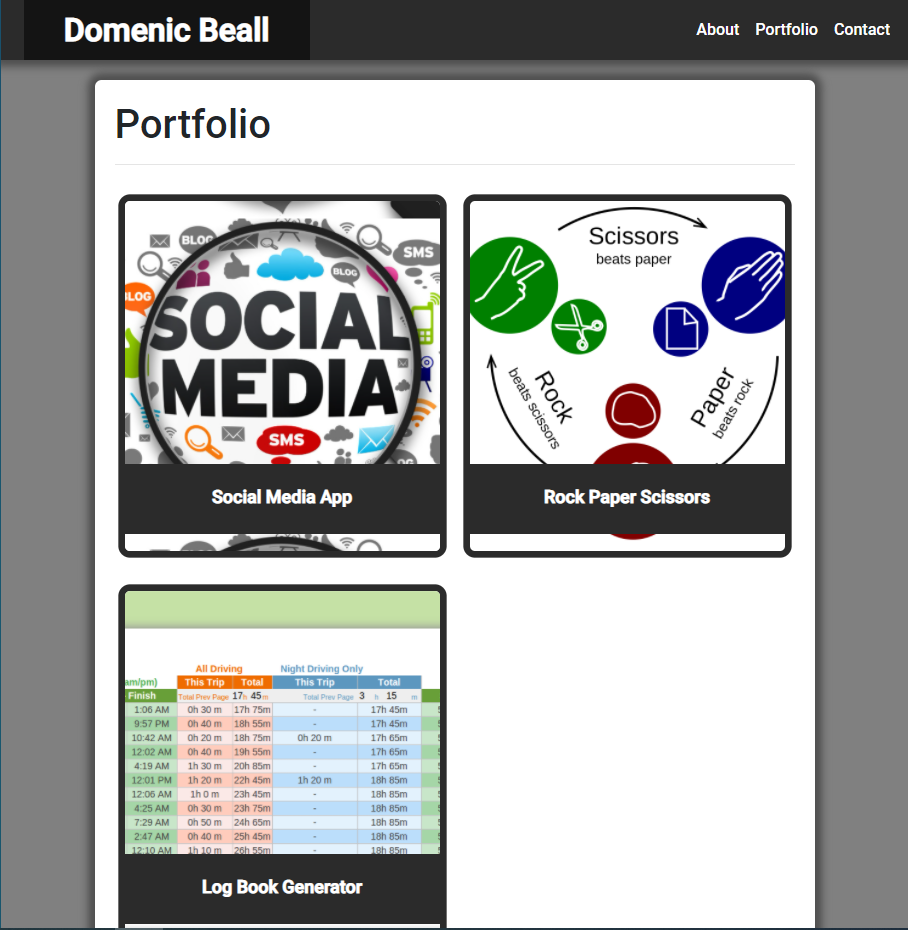
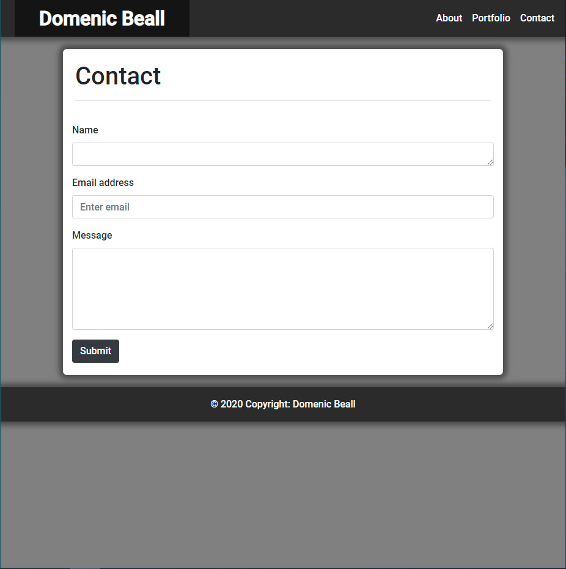

# ResponsivePortfolio

This is a portfolio website that implements responsive media breakpoints so that it can resize to any display without ruining the visuals.

It can be found hosted here: <a href="https://domenicbeall.github.io/ResponsivePortfolio/.">https://domenicbeall.github.io/ResponsivePortfolio/.</a>

